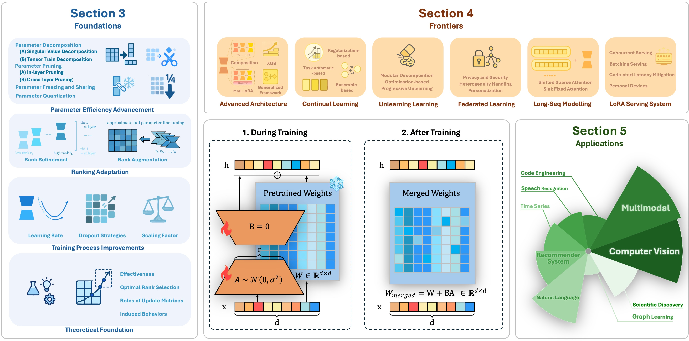

# 🚀 Awesome LoRA Adapter

# Low-rank Adaptation for Foundation Models: Foundations and Frontiers

> This repository is based on the survey paper: [Low-Rank Adaptation for Foundation Models: A Comprehensive Review](https://arxiv.org/abs/2501.00365) by Menglin Yang, Jialin Chen, Yifei Zhang, Jiahong Liu, Jiasheng Zhang, Qiyao Ma, Harshit Verma, Qianru Zhang, Min Zhou, Irwin King, Rex Ying.

## Introduction

Low-rank adaptation (LoRA) has become a core paradigm for adapting foundation models across language, vision, multimodal learning, recommendation, and systems settings. In this repository, we organize papers around core mechanisms, adaptation settings, and domains or modalities. Following the lightweight overview-plus-index style used in our other collections, this `README.md` tracks the latest venue updates, while the detailed taxonomy is maintained in [papers.md](papers.md).

We will keep updating this repository with recent conference papers and noteworthy LoRA developments. If you notice missing papers or broken links, please contact us at `menglin.yang[@]outlook.com`.

## Table of Contents

<table>
<tr><td colspan="2"><a href="papers.md#1-foundations-and-core-mechanisms" style="color:#B22222">1. Foundations and Core Mechanisms</a></td></tr>
<tr>
    <td>&ensp;<a href="papers.md#a-parameter-efficiency-and-structural-design">1.1 Parameter Efficiency and Structural Design</a></td>
    <td>&ensp;<a href="papers.md#b-rank-design-and-capacity-scaling">1.2 Rank Design and Capacity Scaling</a></td>
</tr>
<tr>
    <td>&ensp;<a href="papers.md#c-optimization-initialization-and-training-dynamics">1.3 Optimization, Initialization, and Training Dynamics</a></td>
    <td>&ensp;<a href="papers.md#d-theory-and-analysis">1.4 Theory and Analysis</a></td>
</tr>
<tr><td colspan="2"><a href="papers.md#2-adaptation-settings-and-systems" style="color:#B22222">2. Adaptation Settings and Systems</a></td></tr>
<tr>
    <td>&ensp;<a href="papers.md#a-composition-routing-and-structural-extensions">2.1 Composition, Routing, and Structural Extensions</a></td>
    <td>&ensp;<a href="papers.md#b-long-context-and-sequence-modeling">2.2 Long-Context and Sequence Modeling</a></td>
</tr>
<tr>
    <td>&ensp;<a href="papers.md#c-continual-and-lifelong-adaptation">2.3 Continual and Lifelong Adaptation</a></td>
    <td>&ensp;<a href="papers.md#d-federated-and-distributed-adaptation">2.4 Federated and Distributed Adaptation</a></td>
</tr>
<tr>
    <td>&ensp;<a href="papers.md#e-pretraining-and-full-training">2.5 Pretraining and Full Training</a></td>
    <td>&ensp;<a href="papers.md#f-serving-and-systems">2.6 Serving and Systems</a></td>
</tr>
<tr><td colspan="2"><a href="papers.md#3-domains-and-modalities" style="color:#B22222">3. Domains and Modalities</a></td></tr>
<tr>
    <td>&ensp;<a href="papers.md#a-language-and-nlp">3.1 Language and NLP</a></td>
    <td>&ensp;<a href="papers.md#b-vision-and-generative-vision">3.2 Vision and Generative Vision</a></td>
</tr>
<tr>
    <td>&ensp;<a href="papers.md#c-multimodal-and-vision-language">3.3 Multimodal and Vision-Language</a></td>
    <td>&ensp;<a href="papers.md#d-speech-and-audio">3.4 Speech and Audio</a></td>
</tr>
<tr>
    <td>&ensp;<a href="papers.md#e-code-and-software-engineering">3.5 Code and Software Engineering</a></td>
    <td>&ensp;<a href="papers.md#f-scientific-biomedical-and-physics">3.6 Scientific, Biomedical, and Physics</a></td>
</tr>
<tr>
    <td>&ensp;<a href="papers.md#g-structured-data-graphs-and-recommendation">3.7 Structured Data: Graphs and Recommendation</a></td>
    <td>&ensp;<a href="papers.md#h-time-series-and-forecasting">3.8 Time Series and Forecasting</a></td>
</tr>
<tr>
    <td>&ensp;<a href="papers.md#i-emerging-applications">3.9 Emerging Applications</a></td>
    <td></td>
</tr>
<tr><td colspan="2"><a href="papers.md#4-resource" style="color:#B22222">4. Resource</a></td></tr>
</table>

## Latest Update

- Add recent papers from WWW 2026, AAAI 2026, ICLR 2026, and conservatively verified CVPR 2026 sources, and re-taxonomize `papers.md` around mechanisms, settings, and domains.

## Overview of LoRA for Foundation Models

<p align="center">
  
</p>

**WWW 2026**

1. [WinFLoRA: Incentivizing Client-Adaptive Aggregation in Federated LoRA under Privacy Heterogeneity](https://arxiv.org/abs/2602.01126), WWW 2026 \
   *Mengsha Kou, Xiaoyu Xia, Ziqi Wang, Ibrahim Khalil, Runkun Luo, Jingwen Zhou, Minhui Xue*

1. [Personalized Parameter-Efficient Fine-Tuning of Foundation Models for Multimodal Recommendation](https://arxiv.org/abs/2602.09445), WWW 2026 \
   *Sunwoo Kim, Hyunjin Hwang, Kijung Shin*

1. [RAIE: Region-Aware Incremental Preference Editing with LoRA for LLM-based Recommendation](https://arxiv.org/abs/2603.00638), WWW 2026 \
   *Jin Zeng, Yupeng Qi, Hui Li, Chengming Li, Ziyu Lyu, Lixin Cui, Lu Bai*

1. [LoRA-E^2: Effective and Efficient Low-rank Adaptation](https://doi.org/10.1145/3774904.3792500), WWW 2026 \
   *Shengkun Zhu, Jinshan Zeng, Yiming Wang, Sheng Wang, Yuan Sun, Shangfeng Chen, Yuan Yao, Qiang Yang*

**AAAI 2026**

1. [FedALT: Federated Fine-Tuning through Adaptive Local Training with Rest-of-World LoRA](https://arxiv.org/abs/2503.11880), AAAI 2026 \
   *Jieming Bian, Lei Wang, Letian Zhang, Jie Xu*

1. [Calibrating and Rotating: A Unified Framework for Weight Conditioning in PEFT](https://arxiv.org/abs/2511.00051), AAAI 2026 \
   *Chang Da, Peng Xue, Yu Li, Yongxiang Liu, Pengxiang Xu, Shixun Zhang*

**ICLR 2026**

1. [LoFT: Low-Rank Adaptation That Behaves Like Full Fine-Tuning](https://arxiv.org/abs/2505.21289), ICLR 2026 \
   *Nurbek Tastan, Stefanos Laskaridis, Martin Takac, Karthik Nandakumar, Samuel Horvath*

1. [IGU-LoRA: Adaptive Rank Allocation via Integrated Gradients and Uncertainty-Aware Scoring](https://arxiv.org/abs/2603.13792), ICLR 2026 \
   *Xuan Cui, Huiyue Li, Run Zeng, Yunfei Zhao, Jinrui Qian, Wei Duan, Bo Liu, Zhanpeng Zhou*

1. [E²LoRA: Efficient and Effective Low-Rank Adaptation with Entropy-Guided Adaptive Sharing](https://openreview.net/forum?id=IQttyo0460), ICLR 2026 \
   *Minglei Li, Peng Ye, Jingqi Ye, Haonan He, Tao Chen*

1. [BoRA: Towards More Expressive Low-Rank Adaptation with Block Diversity](https://arxiv.org/abs/2508.06953), ICLR 2026 \
   *Shiwei Li, Xiandi Luo, Haozhao Wang, Xing Tang, Ziqiang Cui, Dugang Liu, Yuhua Li, Xiuqiang He, Ruixuan Li*

1. [LoRA meets Riemannion: Muon Optimizer for Parametrization-independent Low-Rank Adapters](https://arxiv.org/abs/2507.12142), ICLR 2026 \
   *Vladimir Bogachev, Vladimir Aletov, Alexander Molozhavenko, Denis Bobkov, Vera Soboleva, Aibek Alanov, Maxim Rakhuba*

1. [Bi-LoRA: Efficient Sharpness-Aware Minimization for Fine-Tuning Large-Scale Models](https://arxiv.org/abs/2508.19564), ICLR 2026 \
   *Yuhang Liu, Tao Li, Zhehao Huang, Zuopeng Yang, Xiaolin Huang*

1. [BA-LoRA: Bias-Alleviating Low-Rank Adaptation to Mitigate Catastrophic Inheritance in Large Language Models](https://openreview.net/forum?id=q0X9SiXiRO), ICLR 2026 \
   *Yupeng Chang, Yi Chang, Yuan Wu*

1. [Continual Low-Rank Adapters for LLM-based Generative Recommender Systems](https://arxiv.org/abs/2510.25093), ICLR 2026 \
   *Hyunsik Yoo, Ting-Wei Li, SeongKu Kang, Zhining Liu, Charlie Xu, Qilin Qi, Hanghang Tong*

1. [Co-LoRA: Collaborative Model Personalization on Heterogeneous Multi-Modal Clients](https://openreview.net/forum?id=0g5Dk4Qfh0), ICLR 2026 \
   *Minhyuk Seo, Taeheon Kim, Hankook Lee, Jonghyun Choi, Tinne Tuytelaars*

**CVPR 2026**

1. [CRAFT-LoRA: Content-Style Personalization via Rank-Constrained Adaptation and Training-Free Fusion](https://arxiv.org/abs/2602.18936), CVPR 2026 \
   *Yu Li, Yujun Cai, Chi Zhang*

## Citation

If you find this repository useful, please cite our survey paper:

```bibtex
@article{yang2024low,
  title={Low-Rank Adaptation for Foundation Models: A Comprehensive Review},
  author={Yang, Menglin and Chen, Jialin and Zhang, Yifei and Liu, Jiahong and Zhang, Jiasheng and Ma, Qiyao and Verma, Harshit and Zhang, Qianru and Zhou, Min and King, Irwin and Ying, Rex},
  journal={arXiv preprint arXiv:2501.00365},
  year={2024}
}
```

## Contributing

If you find any LoRA-related papers that are not included in this repository, we welcome your contributions. You can open an issue to report a missing paper or submit a pull request to add it to the appropriate section.
