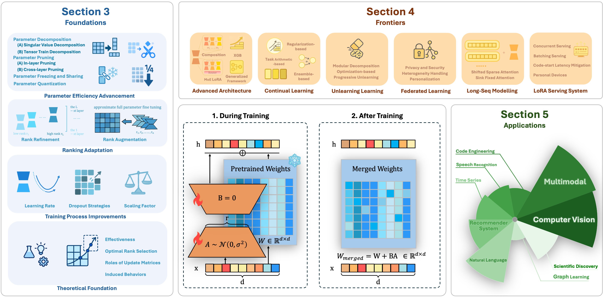

# 🚀 Awesome LoRA Adapter

## Low-rank Adaptation for Foundation Models: Foundations and Frontiers

> This repository is based on the survey paper: [Low-Rank Adaptation for Foundation Models: A Comprehensive Review](https://arxiv.org/abs/2501.00365v2) by Menglin Yang, Jialin Chen, Jinkai Tao, Yifei Zhang, Jiahong Liu, Jiasheng Zhang, Qiyao Ma, Harshit Verma, Regina Zhang, Min Zhou, Irwin King, Rex Ying.

## Introduction

Low-rank adaptation (LoRA) has become a core paradigm for adapting foundation models across language, vision, multimodal learning, recommendation, and systems settings. In this repository, we organize papers around core mechanisms, adaptation settings, and domains or modalities. This `README.md` provides a curated selection of recent venue updates, while the complete taxonomy is maintained in [papers.md](papers.md).

We will keep updating this repository with recent conference papers and noteworthy LoRA developments. If you notice missing papers or broken links, please contact us at `menglin.yang[@]outlook.com`.

## Table of Contents

<table>
<tr><td colspan="2"><a href="papers.md#1-foundations-and-core-mechanisms" style="color:#B22222">1. Foundations and Core Mechanisms</a></td></tr>
<tr>
    <td>&ensp;<a href="papers.md#a-parameter-efficiency-and-structural-design">1.1 Parameter Efficiency and Structural Design</a></td>
    <td>&ensp;<a href="papers.md#b-rank-design-and-capacity-scaling">1.2 Rank Design and Capacity Scaling</a></td>
</tr>
<tr>
    <td>&ensp;<a href="papers.md#c-optimization-initialization-and-training-dynamics">1.3 Optimization, Initialization, and Training Dynamics</a></td>
    <td>&ensp;<a href="papers.md#d-theory-and-analysis">1.4 Theory and Analysis</a></td>
</tr>
<tr><td colspan="2"><a href="papers.md#2-adaptation-settings-and-systems" style="color:#B22222">2. Adaptation Settings and Systems</a></td></tr>
<tr>
    <td>&ensp;<a href="papers.md#a-composition-routing-and-structural-extensions">2.1 Composition, Routing, and Structural Extensions</a></td>
    <td>&ensp;<a href="papers.md#b-long-context-and-sequence-modeling">2.2 Long-Context and Sequence Modeling</a></td>
</tr>
<tr>
    <td>&ensp;<a href="papers.md#c-continual-and-lifelong-adaptation">2.3 Continual and Lifelong Adaptation</a></td>
    <td>&ensp;<a href="papers.md#d-federated-and-distributed-adaptation">2.4 Federated and Distributed Adaptation</a></td>
</tr>
<tr>
    <td>&ensp;<a href="papers.md#e-pretraining-and-full-training">2.5 Pretraining and Full Training</a></td>
    <td>&ensp;<a href="papers.md#f-serving-and-systems">2.6 Serving and Systems</a></td>
</tr>
<tr>
    <td colspan="2">&ensp;<a href="papers.md#g-privacy-security-and-attacks">2.7 Privacy, Security, and Attacks</a></td>
</tr>
<tr><td colspan="2"><a href="papers.md#3-domains-and-modalities" style="color:#B22222">3. Domains and Modalities</a></td></tr>
<tr>
    <td>&ensp;<a href="papers.md#a-language-and-nlp">3.1 Language and NLP</a></td>
    <td>&ensp;<a href="papers.md#b-vision-and-generative-vision">3.2 Vision and Generative Vision</a></td>
</tr>
<tr>
    <td>&ensp;<a href="papers.md#c-multimodal-and-vision-language">3.3 Multimodal and Vision-Language</a></td>
    <td>&ensp;<a href="papers.md#d-speech-and-audio">3.4 Speech and Audio</a></td>
</tr>
<tr>
    <td>&ensp;<a href="papers.md#e-code-and-software-engineering">3.5 Code and Software Engineering</a></td>
    <td>&ensp;<a href="papers.md#f-scientific-biomedical-and-physics">3.6 Scientific, Biomedical, and Physics</a></td>
</tr>
<tr>
    <td>&ensp;<a href="papers.md#g-structured-data-graphs-and-recommendation">3.7 Structured Data: Graphs and Recommendation</a></td>
    <td>&ensp;<a href="papers.md#h-time-series-and-forecasting">3.8 Time Series and Forecasting</a></td>
</tr>
<tr>
    <td>&ensp;<a href="papers.md#i-emerging-applications">3.9 Emerging Applications</a></td>
    <td></td>
</tr>
<tr><td colspan="2"><a href="papers.md#4-resource" style="color:#B22222">4. Resource</a></td></tr>
</table>

## Latest Update

- **2026-08-04:** Add verified papers from WWW, AAAI, ICLR, EACL, ACL, ICML, CVPR, KDD, AISTATS, SIGIR, and COLM 2026; re-taxonomize `papers.md`; remove duplicate entries and repair incorrect links.

## Overview of LoRA for Foundation Models

<p align="center">
  
</p>

## Recent Conference Papers (2026)

**WWW 2026**

1. [WinFLoRA: Incentivizing Client-Adaptive Aggregation in Federated LoRA under Privacy Heterogeneity](https://arxiv.org/abs/2602.01126), WWW 2026 \
   *Mengsha Kou, Xiaoyu Xia, Ziqi Wang, Ibrahim Khalil, Runkun Luo, Jingwen Zhou, Minhui Xue*

1. [Personalized Parameter-Efficient Fine-Tuning of Foundation Models for Multimodal Recommendation](https://arxiv.org/abs/2602.09445), WWW 2026 \
   *Sunwoo Kim, Hyunjin Hwang, Kijung Shin*

1. [RAIE: Region-Aware Incremental Preference Editing with LoRA for LLM-based Recommendation](https://arxiv.org/abs/2603.00638), WWW 2026 \
   *Jin Zeng, Yupeng Qi, Hui Li, Chengming Li, Ziyu Lyu, Lixin Cui, Lu Bai*

1. [LoRA-E^2: Effective and Efficient Low-rank Adaptation](https://doi.org/10.1145/3774904.3792500), WWW 2026 \
   *Shengkun Zhu, Jinshan Zeng, Yiming Wang, Sheng Wang, Yuan Sun, Shangfeng Chen, Yuan Yao, Qiang Yang*

1. [Graph Cross-Domain Continual Fine-Tuning via Orthogonal LoRA Routing with Contrastive Expert Specialization](https://www2026.thewebconf.org/accepted/research-tracks.html), WWW 2026 \
   *Qianyi Cai, Ziyue Qiao, Minghao Yang, Xiao Luo, Hui Xiong*

**AAAI 2026**

1. [FedALT: Federated Fine-Tuning through Adaptive Local Training with Rest-of-World LoRA](https://arxiv.org/abs/2503.11880), AAAI 2026 \
   *Jieming Bian, Lei Wang, Letian Zhang, Jie Xu*

1. [Calibrating and Rotating: A Unified Framework for Weight Conditioning in PEFT](https://arxiv.org/abs/2511.00051), AAAI 2026 \
   *Chang Da, Peng Xue, Yu Li, Yongxiang Liu, Pengxiang Xu, Shixun Zhang*

**ICLR 2026**

1. [LoFT: Low-Rank Adaptation That Behaves Like Full Fine-Tuning](https://arxiv.org/abs/2505.21289), ICLR 2026 \
   *Nurbek Tastan, Stefanos Laskaridis, Martin Takac, Karthik Nandakumar, Samuel Horvath*

1. [IGU-LoRA: Adaptive Rank Allocation via Integrated Gradients and Uncertainty-Aware Scoring](https://arxiv.org/abs/2603.13792), ICLR 2026 \
   *Xuan Cui, Huiyue Li, Run Zeng, Yunfei Zhao, Jinrui Qian, Wei Duan, Bo Liu, Zhanpeng Zhou*

1. [E²LoRA: Efficient and Effective Low-Rank Adaptation with Entropy-Guided Adaptive Sharing](https://openreview.net/forum?id=IQttyo0460), ICLR 2026 \
   *Minglei Li, Peng Ye, Jingqi Ye, Haonan He, Tao Chen*

1. [BoRA: Towards More Expressive Low-Rank Adaptation with Block Diversity](https://arxiv.org/abs/2508.06953), ICLR 2026 \
   *Shiwei Li, Xiandi Luo, Haozhao Wang, Xing Tang, Ziqiang Cui, Dugang Liu, Yuhua Li, Xiuqiang He, Ruixuan Li*

1. [LoRA meets Riemannion: Muon Optimizer for Parametrization-independent Low-Rank Adapters](https://arxiv.org/abs/2507.12142), ICLR 2026 \
   *Vladimir Bogachev, Vladimir Aletov, Alexander Molozhavenko, Denis Bobkov, Vera Soboleva, Aibek Alanov, Maxim Rakhuba*

1. [Bi-LoRA: Efficient Sharpness-Aware Minimization for Fine-Tuning Large-Scale Models](https://arxiv.org/abs/2508.19564), ICLR 2026 \
   *Yuhang Liu, Tao Li, Zhehao Huang, Zuopeng Yang, Xiaolin Huang*

1. [BA-LoRA: Bias-Alleviating Low-Rank Adaptation to Mitigate Catastrophic Inheritance in Large Language Models](https://openreview.net/forum?id=q0X9SiXiRO), ICLR 2026 \
   *Yupeng Chang, Yi Chang, Yuan Wu*

1. [Continual Low-Rank Adapters for LLM-based Generative Recommender Systems](https://arxiv.org/abs/2510.25093), ICLR 2026 \
   *Hyunsik Yoo, Ting-Wei Li, SeongKu Kang, Zhining Liu, Charlie Xu, Qilin Qi, Hanghang Tong*

1. [Co-LoRA: Collaborative Model Personalization on Heterogeneous Multi-Modal Clients](https://openreview.net/forum?id=0g5Dk4Qfh0), ICLR 2026 \
   *Minhyuk Seo, Taeheon Kim, Hankook Lee, Jonghyun Choi, Tinne Tuytelaars*

**EACL 2026 / Findings of EACL 2026**

1. [RB-LoRA: Rank-Balanced Aggregation for Low-Rank Adaptation with Federated Fine-Tuning](https://aclanthology.org/2026.findings-eacl.88/), Findings of EACL 2026 \
   *Sihyeon Ha, Yongjeong Oh, Yo-Seb Jeon*

1. [RoZO: Geometry-Aware Zeroth-Order Fine-Tuning on Low-Rank Adapters for Black-Box Large Language Models](https://aclanthology.org/2026.eacl-long.80/), EACL 2026 \
   *Zichen Song, Weijia Li*

1. [Parameter-Efficient Routed Fine-Tuning: Mixture-of-Experts Demands Mixture of Adaptation Modules](https://aclanthology.org/2026.findings-eacl.232/), Findings of EACL 2026 \
   *Yilun Liu, Yunpu Ma, Yuetian Lu, Shuo Chen, Zifeng Ding, Volker Tresp*

1. [Sparse Adapter Fusion for Continual Learning in NLP](https://aclanthology.org/2026.eacl-long.37/), EACL 2026 \
   *Min Zeng, Xi Chen, Haiqin Yang, Yike Guo*

1. [Completely Modular Fine-tuning for Dynamic Language Adaptation](https://aclanthology.org/2026.findings-eacl.252/), Findings of EACL 2026 \
   *Zhe Cao, Yusuke Oda, Qianying Liu, Akiko Aizawa, Taro Watanabe*

1. [TIPA: Typologically Informed Parameter Aggregation](https://aclanthology.org/2026.findings-eacl.119/), Findings of EACL 2026 \
   *Stef Accou, Wessel Poelman*

**ACL 2026 / Findings of ACL 2026**

1. [Not All Directions Matter: Towards Structured and Task-Aware Low-Rank Model Adaptation](https://aclanthology.org/2026.acl-long.97/), ACL 2026 \
   *Xi Xiao, Chenrui Ma, Yunbei Zhang, Chen Liu, Zhuxuanzi Wang, Yanshu Li, Lin Zhao, Guosheng Hu, Tianyang Wang, Hao Xu*

1. [TalkLoRA: Communication-Aware Mixture of Low-Rank Adaptation for Large Language Models](https://aclanthology.org/2026.acl-long.840/), ACL 2026 \
   *Lin Mu, Haiyang Wang, Li Ni, Lei Sang, Zhize Wu, Peiquan Jin, Yiwen Zhang*

1. [LoRA on the Go: Instance-level Dynamic LoRA Selection and Merging](https://aclanthology.org/2026.acl-long.1837/), ACL 2026 \
   *Seungeon Lee, Soumi Das, Manish Gupta, Krishna P. Gummadi*

1. [FARSS: Fisher-Optimized Adaptive Low-Rank and Singular-Vector Selection for Knowledge-Preserving Fine-Tuning](https://aclanthology.org/2026.findings-acl.883/), Findings of ACL 2026 \
   *Renxing Chen, Ziwei Xiang, Peisong Wang, Hongjian Fang, Meng Li, Fanhu Zeng, Yanan Zhu, Peipei Yang, Xu-Yao Zhang, Jian Cheng*

1. [SDC-LoRA: Singular-Subspace Drift Controlled LoRA to Mitigate Knowledge Forgetting](https://aclanthology.org/2026.findings-acl.1207/), Findings of ACL 2026 \
   *Geyuan Zhang, Xiaofei Zhou, Shihao Liu, Jingyuan Tian, Jizheng Ma*

1. [GraphLoRA: Structure-Aware Low-Rank Adaptation for Large Language Model Recommendation](https://aclanthology.org/2026.findings-acl.645/), Findings of ACL 2026 \
   *Lin Mu, Guoji Wang, Li Ni, Lei Sang, Zhize Wu, Peiquan Jin, Yiwen Zhang*

**ICML 2026**

1. [ScaLoRA: Optimally Scaled Low-Rank Adaptation for Efficient High-Rank Fine-Tuning](https://icml.cc/virtual/2026/poster/63892), ICML 2026 \
   *Yilang Zhang, Xiaodong Yang, Yiwei Cai, Georgios B. Giannakis*

1. [Balanced LoRA: Removing Parameter Invariance to Accelerate Convergence](https://icml.cc/virtual/2026/poster/62055), ICML 2026 \
   *Valerie Castin, Kimia Nadjahi, Pierre Ablin, Gabriel Peyre*

1. [MoLoRA: Composable Specialization via Per-Token Adapter Routing](https://icml.cc/virtual/2026/poster/66486), ICML 2026 \
   *Shrey Shah, Justin Wagle*

1. [Compress then Merge: From Multiple LoRAs into One Low-Rank Adapter](https://icml.cc/virtual/2026/poster/61546), ICML 2026 \
   *Zhengbao He, Ruiqi Ding, Zhehao Huang, Ruikai Yang, Tao Li, Xiaolin Huang*

1. [FedRot-LoRA: Mitigating Rotational Misalignment in Federated LoRA](https://icml.cc/virtual/2026/poster/66566), ICML 2026 \
   *Haoran Zhang, Dongjun Kim, Seohyeon Cha, Haris Vikalo*

1. [PLoRA: Efficient Concurrent LoRA Training for Large Language Models](https://icml.cc/virtual/2026/poster/62013), ICML 2026 \
   *Minghao Yan, Zhuang Wang, Zhen Jia, Shivaram Venkataraman, Yida Wang*

1. [CLIMB: Taming the LoRA Residency Cliff in Multi-LoRA Serving](https://icml.cc/virtual/2026/poster/66332), ICML 2026 \
   *Haoran Zhang, Zhiyu Liang, Decheng Zuo, Hongzhi Wang*

**CVPR 2026**

1. [CRAFT-LoRA: Content-Style Personalization via Rank-Constrained Adaptation and Training-Free Fusion](https://arxiv.org/abs/2602.18936), CVPR 2026 \
   *Yu Li, Yujun Cai, Chi Zhang*

1. [SG-LoRA: Semantic-guided LoRA Parameters Generation](https://openaccess.thecvf.com/content/CVPR2026/html/Li_SG-LoRA_Semantic-guided_LoRA_Parameters_Generation_CVPR_2026_paper.html), CVPR 2026 \
   *Miaoge Li, Yang Chen, Zhijie Rao, Can Jiang, Kang Wei, Jingcai Guo*

1. [HiLoRA: Hierarchical Low-Rank Adaptation for Personalized Federated Learning](https://openaccess.thecvf.com/content/CVPR2026/html/Peng_HiLoRA_Hierarchical_Low-Rank_Adaptation_for_Personalized_Federated_Learning_CVPR_2026_paper.html), CVPR 2026 \
   *Zihao Peng, Nan Zou, Jiandian Zeng, Guo Li, Ke Chen, Boyuan Li, Tian Wang*

1. [Preference-Aligned LoRA Merging: Preserving Subspace Coverage and Addressing Directional Anisotropy](https://openaccess.thecvf.com/content/CVPR2026/html/Jeong_Preference-Aligned_LoRA_Merging_Preserving_Subspace_Coverage_and_Addressing_Directional_Anisotropy_CVPR_2026_paper.html), CVPR 2026 \
   *Wooseong Jeong, Wonyoung Lee, Kuk-Jin Yoon*

1. [TAS-LoRA: Transformer Architecture Search with Mixture-of-LoRA Experts](https://openaccess.thecvf.com/content/CVPR2026/html/Jeon_TAS-LoRA_Transformer_Architecture_Search_with_Mixture-of-LoRA_Experts_CVPR_2026_paper.html), CVPR 2026 \
   *Jeimin Jeon, Hyunju Lee, Bumsub Ham*

**KDD 2026**

1. [LoRAShield: Data-Free Editing Alignment for Secure Personalized LoRA Sharing](https://doi.org/10.1145/3770855.3817625), KDD 2026 \
   *Jiahao Chen, Junhao Li, Yiming Wang, Yong Yang, Yi Jiang, Chunyi Zhou, Qingming Li, Tianyu Du, Shouling Ji*

1. [Modality-Agnostic Zeroth-Order LoRA Fine-Tuning for Black-Box Prompt Optimization](https://doi.org/10.1145/3770855.3817738), KDD 2026 \
   *Xingchen Li, Jia Zhang, Tianxing Man, Wenkang Wang, Bin Gu*

1. [HeteroFL-LoRA: Federated LoRA Fine-Tuning Across Heterogeneous LFMs via Singular Value Collaboration](https://doi.org/10.1145/3770855.3817794), KDD 2026 \
   *Zhuojia Wu, Qi Zhang, Xuerong Zhao, Duoqian Miao, Kun Yi, Liang Hu*

1. [G$^2$LoRA: Gradient Orthogonal Low-Rank Adaptation Framework for Graph Continual Learning on Text-Attributed Graphs](https://doi.org/10.1145/3770855.3817966), KDD 2026 \
   *Yuhan Wang, Yibo Ding, Yutong Ye, Mufan Zhao, Wenbo Zhang, Ruijie Wang, Jianxin Li*

1. [DyMerge-LoRA: On-GPU Post-Merge Fusion for High-Throughput Multi-Tenant Composite LoRA Serving](https://doi.org/10.1145/3770854.3780270), KDD 2026 \
   *Rui Xu, Long Chen, Huazheng Lao, Jinquan Zhang, Xia Zhu*

**AISTATS 2026**

1. [MineGrad: Gradient Inversion Attacks on LoRA Fine-Tuning](https://virtual.aistats.org/virtual/2026/poster/13520), AISTATS 2026 \
   *Hasin Us Sami, Swapneel Sen, Basak Guler*

**SIGIR 2026**

1. [Unifying Search and Recommendation in LLMs via Gradient Multi-Subspace Tuning](https://doi.org/10.1145/3805712.3809719), SIGIR 2026 \
   *Jujia Zhao, Zihan Wang, Shuaiqun Pan, Suzan Verberne, Zhaochun Ren*

**COLM 2026**

1. [LORA-CRAFT: Cross-layer Rank Adaptation via Frozen Tucker Decomposition of Pre-trained Attention Weights](https://colmweb.org/AcceptedPapers.html), COLM 2026 \
   *Kasun Dewage, Marianna Pensky, Suranadi De Silva, Shankhadeep Mondal*

1. [DR-LoRA: Dynamic Rank LoRA for Fine-Tuning Mixture-of-Experts Models](https://colmweb.org/AcceptedPapers.html), COLM 2026 \
   *Guanzhi Deng, Bo Li, Ronghao Chen, Xiujin Liu, Huacan Wang, Zhuo Han, Lijie Wen, Linqi Song*

1. [CeRA: Extreme Parameter Efficiency in Low-Rank Adaptation via Non-linear Expansion](https://colmweb.org/AcceptedPapers.html), COLM 2026 \
   *Hung-Hsuan Chen*

1. [Reinforcement Routing for Mixtures of LoRAs in Parameter-Efficient LLM Finetuning](https://colmweb.org/AcceptedPapers.html), COLM 2026 \
   *Ruizhong Qiu, Hanqing Zeng, Yinglong Xia, Yiwen Meng, Ren Chen, Jiarui Feng, Dongqi Fu, Qifan Wang, Jiayi Liu, Jun Xiao, Xiangjun Fan, Benyu Zhang, Hong Li, Zhining Liu, Hyunsik Yoo, Zhichen Zeng, Tianxin Wei, Hanghang Tong*

## Citation

If you find this repository useful, please cite our survey paper:

```bibtex
@article{yang2024low,
  title={Low-Rank Adaptation for Foundation Models: A Comprehensive Review},
  author={Yang, Menglin and Chen, Jialin and Tao, Jinkai and Zhang, Yifei and Liu, Jiahong and Zhang, Jiasheng and Ma, Qiyao and Verma, Harshit and Zhang, Regina and Zhou, Min and King, Irwin and Ying, Rex},
  journal={arXiv preprint arXiv:2501.00365},
  year={2024}
}
```

## Contributing

If you find any LoRA-related papers that are not included in this repository, we welcome your contributions. You can open an issue to report a missing paper or submit a pull request to add it to the appropriate section.
